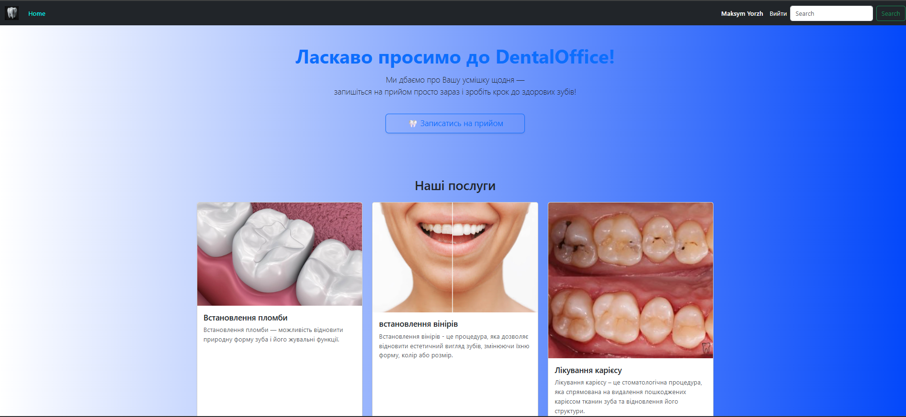
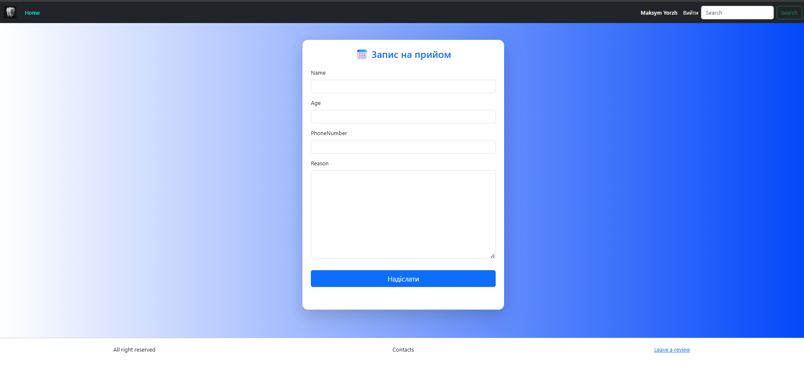
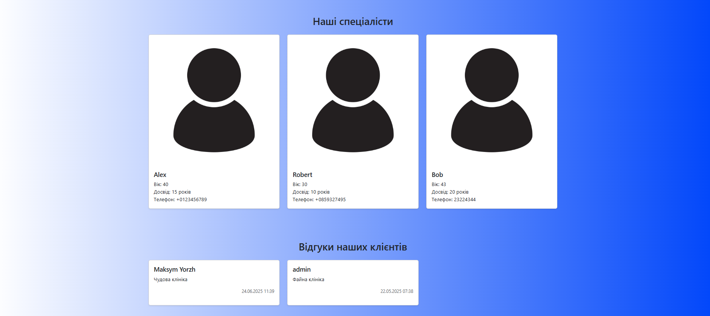

# 🦷 DentalOffice — вебдодаток для стоматологічної клініки

**DentalOffice** — це повнофункціональний вебзастосунок, розроблений на Django, який дозволяє клієнтам:

- Переглядати стоматологічні послуги
- Записуватись до лікаря онлайн
- Залишати відгуки про прийом
- Переглядати профілі стоматологів
- Редагувати особистий профіль

---

## 🔧 Технології

- **Python 3.10**, **Django 4.x**
- **HTML5**, **CSS3**, **Bootstrap 5**
- **SQLite** (можна замінити на PostgreSQL)
- Django Templates
- Django Forms + CSRF protection

---

## 💡 Основний функціонал

- 🗓 Онлайн-запис на прийом
- 👨‍⚕️ Список стоматологів з фото, віком, досвідом
- 🔐 Авторизація, реєстрація, вихід
- ✏️ Редагування профілю користувача
- 🗣 Залишення та редагування відгуків
- 📱 Адаптивний інтерфейс для мобільних і ПК

---

## 📸 Скриншоти






---

## 🚀 Запуск проєкту локально

```bash
git clone https://github.com/maksirh/DentalOffice_django.git
cd DentalOffice_django
python -m venv venv
source venv/bin/activate  # або venv\Scripts\activate на Windows
pip install -r requirements.txt
python manage.py migrate
python manage.py runserver
